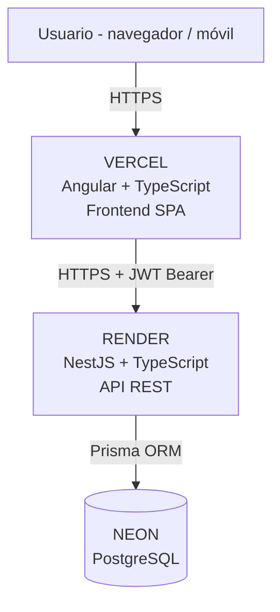
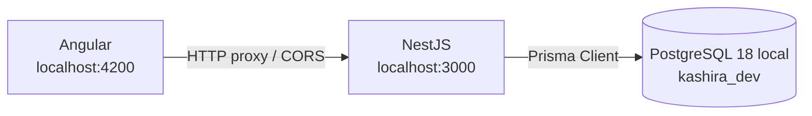
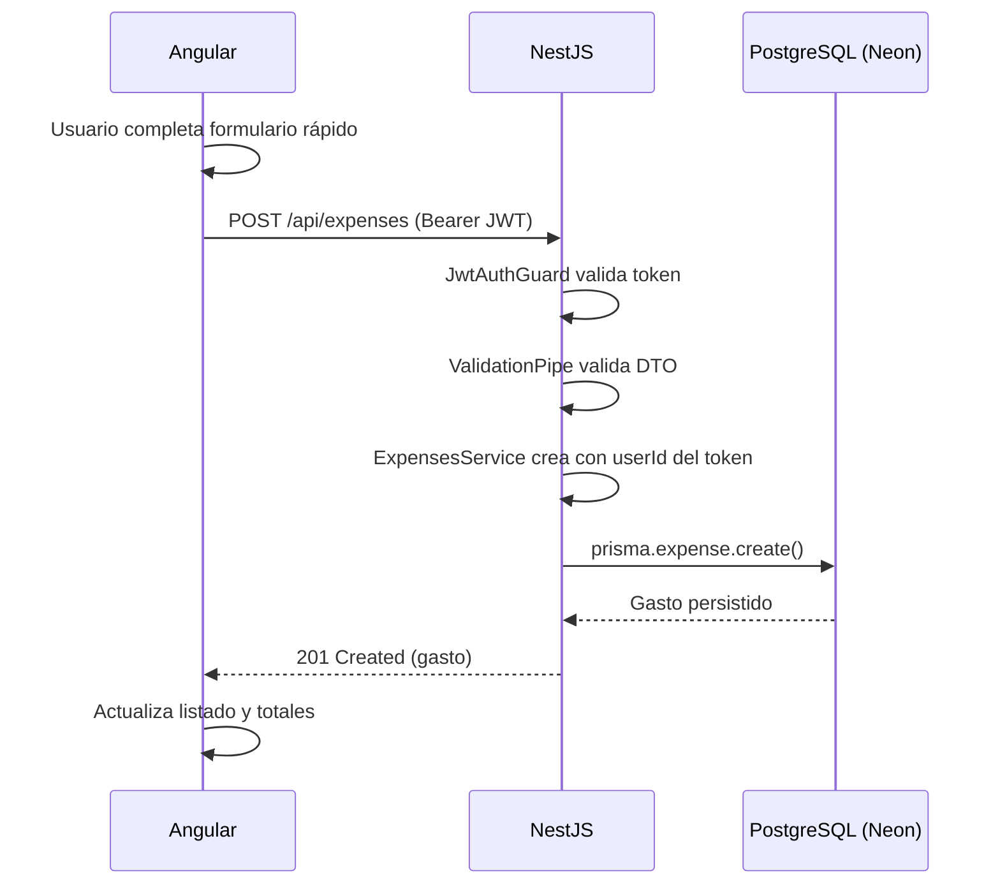

# 04 — Arquitectura General

**Kashira Finance** — Arquitectura objetivo y de desarrollo.

---

## 1. Principios arquitectónicos

1. **Monolito modular**: un único backend NestJS organizado por dominios. Sin microservicios.
2. **Separación clara de capas**: Controller → Service → Prisma (backend); Features + Core (frontend).
3. **API REST** con JSON, versionada bajo prefijo `/api`.
4. **Seguridad en backend**: el frontend nunca es la barrera de autorización.
5. **Sin sobreingeniería**: la infraestructura más simple que cumpla los objetivos (sin Docker, sin Kubernetes).

## 2. Arquitectura de producción



## 3. Arquitectura de desarrollo



- Desarrollo usa **PostgreSQL 18 local** (`localhost:5432`, base `kashira_dev`, rol dedicado `kashira_app` — ver ADR-015).
- Producción usa Neon; las migraciones se aplican ahí vía deploy.
- Variables separadas por entorno (`backend/.env` para dev, dashboard de Render para prod).

## 4. Estructura del monorepo

```
KashiraFinance/
├── docs/                    # Documentación (fuente de verdad)
├── frontend/                # Aplicación Angular
│   └── src/app/
│       ├── core/            # guards, interceptors, services, models
│       ├── auth/            # login, registro
│       ├── dashboard/
│       ├── expenses/
│       ├── incomes/
│       ├── categories/
│       ├── reports/
│       ├── layout/          # shell, navegación
│       └── shared/          # componentes y utilidades reutilizables
├── backend/                 # API NestJS
│   ├── src/
│   │   ├── auth/            # register, login, jwt strategy, guards
│   │   ├── users/
│   │   ├── expenses/
│   │   ├── incomes/
│   │   ├── categories/
│   │   ├── dashboard/
│   │   ├── reports/         # MVP: agregaciones ligeras
│   │   ├── prisma/          # PrismaService + PrismaModule
│   │   └── common/          # decoradores, filtros, pipes, enums
│   ├── prisma/
│   │   └── schema.prisma
│   └── .env.example
├── .gitignore
└── README.md
```

Despliegue: Vercel y Render configuran **root directory** (`frontend/` y `backend/` respectivamente) sobre este mismo repositorio.

## 5. Flujo de una petición típica (crear gasto)



## 6. Decisiones arquitectónicas clave

| Decisión | Justificación | Detalle |
|----------|---------------|---------|
| Monolito modular NestJS | Simplicidad operativa; un solo deploy; módulos desacoplados preparan etapa 2 | `06-arquitectura-backend.md` |
| Angular standalone components | Estándar moderno del framework; menos boilerplate | `05-arquitectura-frontend.md` |
| Prisma como ORM | Tipado end-to-end, migraciones claras, DX superior | `12-decisiones-tecnicas.md` |
| Neon PostgreSQL gestionado | Free tier real, Postgres estándar, branching para entornos | `10-despliegue.md` |
| JWT stateless en header | Simple para MVP; CSRF no aplica a tokens en header | `09-autenticacion-y-seguridad.md` |
| REST `/api` prefijo | Claridad, compatibilidad con proxies y futuras versiones | `08-api.md` |

## 7. Qué NO forma parte de la arquitectura (explícitamente)

- Docker / Kubernetes / microservicios.
- Redis u otra capa de caché externa.
- GraphQL o WebSockets.
- SSR/Angular Universal (SPA suficiente; SEO no aplica a app privada).
- Colas de mensajes / event-driven.
