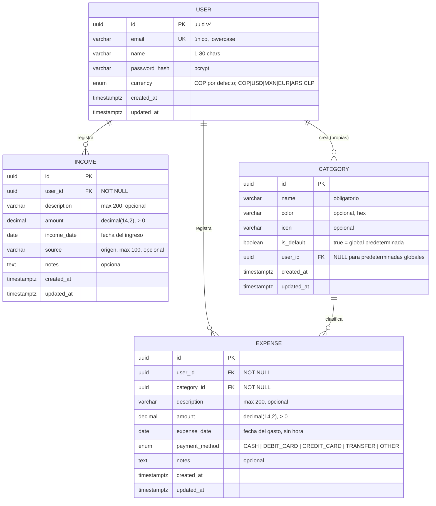

# 07 — Modelo de Datos

**Kashira Finance** — MVP Etapa 1. Entidades: `User`, `Category`, `Expense`, `Income`.

---

## 1. Diagrama Entidad-Relación



## 2. Decisiones de diseño

### 2.1 Claves primarias — UUID

- UUID v4 (`@default(uuid())` en Prisma): no enumeran volumen ni orden, seguros de exponer en URLs, preparados para futuro multi-entorno.
- Alternativa descartada: `serial`/`int` (fuga de información, colisiones al migrar datos).

### 2.2 Montos — `Decimal(14,2)`

- Los montos financieros no pueden ser float (errores de redondeo).
- Prisma mapea `Decimal` y se serializa como **string** en JSON; el frontend formatea visualmente.
- Precisión suficiente para etapa 2 (negocios). Rango máximo: 999,999,999,999.99.

### 2.3 Fechas

| Campo | Tipo | Motivo |
|-------|------|--------|
| `expense_date` / `income_date` | `DATE` (solo fecha) | El día importa para reportes mensuales; la hora del gasto no aporta valor analítico y evita bugs de timezone en agregaciones. |
| `created_at` / `updated_at` | `TIMESTAMPTZ` UTC | Auditoría con precisión; `@updatedAt` automático en Prisma. |

Regla: el backend calcula rangos mensuales sobre `DATE` directamente (sin conversiones TZ); el frontend muestra en formato local `dd/mm/yyyy`.

### 2.4 Categorías — modelo híbrido (aprobado)

Una sola tabla con flag:

- `is_default = true`, `user_id = NULL` → predeterminada global (11 categorías semilla vía migración/seed).
- `is_default = false`, `user_id = NOT NULL` → personalizada del usuario.
- Unicidad de nombre por usuario: índice único `(user_id, name)` — en PostgreSQL los NULL no chocan, así las globales no se afectan; adicionalmente se valida en el service.
- Las predeterminadas **no** son editables ni eliminables por usuarios (`is_default` ignorado en DTOs de update/delete).
- El listado `GET /api/categories` retorna defaults + propias en una sola respuesta.

### 2.5 Reglas de eliminación

| Relación | Regla | Comportamiento |
|----------|-------|----------------|
| User → Expense / Income / Category( propias) | `ON DELETE CASCADE` | Borrar cuenta elimina sus datos (MVP: hard delete). |
| Category → Expense | `ON DELETE RESTRICT` (comportamiento Prisma default con verificación previa) | Rechazado con 409 si la categoría tiene gastos. El usuario debe reasignar o eliminar primero. Reasignación automática a "Otros": mejora futura documentada. |
| Gasto / Ingreso | Hard delete físico en MVP | Soft delete queda como decisión pendiente (ver `12-decisiones-tecnicas.md`). |

### 2.6 Integridad referencial

- Todas las FK obligatorias declaradas en Prisma (`@relation`).
- `categoryId` debe pertenecer al mismo usuario o ser predeterminada → validado en service antes de crear/editar gasto.

## 3. Índices

| Tabla | Índice | Motivo |
|-------|--------|--------|
| `users` | UNIQUE(`email`) | Login y unicidad. |
| `expenses` | (`user_id`, `expense_date` DESC) | Listados y agregaciones mensuales del dashboard. |
| `expenses` | (`user_id`, `category_id`) | Agrupación por categoría. |
| `incomes` | (`user_id`, `income_date` DESC) | Listados y totales mensuales. |
| `categories` | (`user_id`, `name`) UNIQUE parcial | Unicidad de nombre propio. |

Con volúmenes personales (< 100k filas) esto es más que suficiente; se revisará con etapa 2.

## 4. Restricciones de negocio (validadas en backend)

| Regla |
|-------|
| `amount > 0` en gastos e ingresos. |
| Fecha de movimiento: cualquier fecha válida (default hoy); no se restringen fechas futuras (pagos programados manualmente). |
| `description` máx. 200 caracteres; `notes` máx. 1000. |
| Email normalizado a minúsculas antes de crear/buscar. |
| Contraseña mínimo 8 caracteres (política MVP; complejidad forzosa no obligatoria). |

## 5. Schema Prisma preliminar (borrador para revisión)

> No se ejecutan migraciones hasta aprobar este modelo.

```prisma
enum PaymentMethod {
  CASH
  DEBIT_CARD
  CREDIT_CARD
  TRANSFER
  OTHER
}

model User {
  id           String   @id @default(uuid())
  email        String   @unique
  name         String
  passwordHash String
  createdAt    DateTime @default(now())
  updatedAt    DateTime @updatedAt

  expenses      Expense[]
  incomes       Income[]
  categories    Category[]

  @@map("users")
}

model Category {
  id        String   @id @default(uuid())
  name      String
  color     String?
  icon      String?
  isDefault Boolean  @default(false)
  userId    String?
  user      User?    @relation(fields: [userId], references: [id], onDelete: Cascade)
  expenses  Expense[]
  createdAt DateTime @default(now())
  updatedAt DateTime @updatedAt

  @@unique([userId, name])
  @@map("categories")
}

model Expense {
  id            String        @id @default(uuid())
  userId        String
  categoryId    String
  description   String?
  amount        Decimal       @db.Decimal(14, 2)
  expenseDate   DateTime      @db.Date
  paymentMethod PaymentMethod @default(CASH)
  notes         String?
  user          User          @relation(fields: [userId], references: [id], onDelete: Cascade)
  category      Category      @relation(fields: [categoryId], references: [id], onDelete: Restrict)
  createdAt     DateTime      @default(now())
  updatedAt     DateTime      @updatedAt

  @@index([userId, expenseDate(sort: Desc)])
  @@index([userId, categoryId])
  @@map("expenses")
}

model Income {
  id          String   @id @default(uuid())
  userId      String
  description String?
  amount      Decimal  @db.Decimal(14, 2)
  incomeDate  DateTime @db.Date
  source      String?
  notes       String?
  user        User     @relation(fields: [userId], references: [id], onDelete: Cascade)
  createdAt   DateTime @default(now())
  updatedAt   DateTime @updatedAt

  @@index([userId, incomeDate(sort: Desc)])
  @@map("incomes")
}
```

## 6. Datos semilla (seed)

11 categorías predeterminadas con `isDefault: true, userId: null`. Idempotente (upsert por nombre).

## 7. Futuras entidades (NO implementar en MVP)

Documentadas para referencia de evolución: `Account` (cuentas/billeteras), `Budget`, `Organization` + `Membership` + `Role` (etapas 2–3). La estructura actual no impide agregarlas.

---

## 8. Etapa 2+ — Deudas, Servicios y Moneda

Añadidas tras el MVP inicial (migración `add_currency_and_services`).

### 8.1 Moneda de usuario (`User.currency`)

- Enum `Currency`: `COP | USD | MXN | EUR | ARS | CLP`.
- `User.currency` con `@default(COP)`. Se elige al registrarse y se edita desde Configuración (`PATCH /api/users/settings`).
- La moneda solo afecta el **formato de presentación** (símbolo y miles/decimas). El valor numérico de ingresos/gastos **no se convierte** entre divisas.

### 8.2 Deudas (`Debt` y `DebtPayment`)

```prisma
model Debt {
  id                 String   @id @default(uuid())
  userId             String
  kind               DebtKind @default(ENTITY) // ENTITY | PERSONAL
  name               String
  lender             String?
  totalAmount        Decimal  @db.Decimal(14, 2)
  totalInstallments  Int?
  paidInstallments   Int?
  installmentAmount  Decimal? @db.Decimal(14, 2)
  startDate          DateTime @db.Date
  dueDate            DateTime? @db.Date
  notes              String?
  createdAt          DateTime @default(now())
  updatedAt          DateTime @updatedAt
  payments           DebtPayment[]
  user               User @relation(fields: [userId], references: [id], onDelete: Cascade)

  @@index([userId])
  @@map("debts")
}

model DebtPayment {
  id        String         @id @default(uuid())
  debtId    String
  userId    String
  amount    Decimal        @db.Decimal(14, 2)
  paidDate  DateTime       @db.Date
  notes     String?
  createdAt DateTime       @default(now())
  debt      Debt           @relation(fields: [debtId], references: [id], onDelete: Cascade)
  user      User           @relation(fields: [userId], references: [id], onDelete: Cascade)

  @@index([userId])
  @@map("debt_payments")
}
```

- Cada abono de deuda crea un `Expense` asociado, enlazado por `Expense.debtPaymentId` (columna UUID con índice, sin relación FK, para evitar mismatch de tipo con otras tablas).

### 8.3 Servicios (`Service` y `ServicePayment`)

```prisma
enum ServiceState { ACTIVE INACTIVE } // reservado

model Service {
  id        String   @id @default(uuid())
  userId    String
  name      String
  color     String?
  icon      String?
  notes     String?
  createdAt DateTime @default(now())
  updatedAt DateTime @updatedAt
  payments  ServicePayment[]
  user      User @relation(fields: [userId], references: [id], onDelete: Cascade)

  @@index([userId])
  @@map("services")
}

model ServicePayment {
  id        String     @id @default(uuid())
  serviceId String
  userId    String
  amount    Decimal    @db.Decimal(14, 2)
  paidDate  DateTime   @db.Date
  notes     String?
  createdAt DateTime   @default(now())
  service   Service    @relation(fields: [serviceId], references: [id], onDelete: Cascade)
  user      User       @relation(fields: [userId], references: [id], onDelete: Cascade)

  @@index([userId])
  @@map("service_payments")
}
```

- Cada pago de servicio crea un `Expense` asociado, enlazado por `Expense.servicePaymentId` (`@unique`, 1:1, sin relación FK).
- Si no se indica categoría, el backend resuelve (o crea) la categoría "Servicios" del usuario.
- `ServicePayment` no tiene FK a `service_payments` (espejo del patrón de deudas) para evitar mismatch de tipo (UUID vs TEXT).

### 8.4 Ajustes a `Expense`

- Añadidas columnas `debt_payment_id` y `service_payment_id` (UUID, indexadas). Mantienen el vínculo opcional con los pagos de deuda/servicio que originan el gasto.

