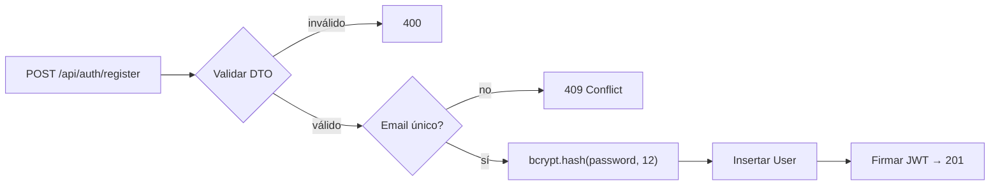

# 09 — Autenticación y Seguridad

---

## 1. Autenticación

### 1.1 Registro



- Contraseña jamás se guarda ni loguea en texto plano; solo `passwordHash` (bcrypt cost 12).
- Email normalizado a minúsculas.

### 1.2 Login

1. Buscar usuario por email.
2. `bcrypt.compare(password, hash)` — comparación en tiempo constante.
3. Fallo → **401 genérico** (`Credenciales inválidas`), sin revelar si falló email o contraseña.
4. Éxito → JWT firmado con `JWT_SECRET`, payload:

```json
{ "sub": "<user.id>", "email": "user@mail.com", "iat": 1755800000, "exp": ... }
```

Expiración: **7 días** (decisión MVP — ver ADR). Algoritmo HS256 (mismo servicio emite y valida).

### 1.3 Validación de peticiones

- `JwtStrategy` valida firma + expiración + que el usuario aún exista.
- **Guard global** `JwtAuthGuard` vía `APP_GUARD`; endpoints públicos con decorador `@Public()`: register, login, health.
- `@CurrentUser()` inyecta el usuario del token; el backend **nunca** acepta `userId` desde el cliente.

### 1.4 Logout

JWT stateless: el cliente elimina el token de `localStorage`. Revocación server-side no existe en MVP (mejora futura: refresh tokens + blacklist).

## 2. Autorización multiusuario

Regla única e innegociable: **toda query de datos filtra por el `userId` del token**.

```ts
// Patrón obligatorio en services
prisma.expense.findFirst({ where: { id, userId } });      // detalle
prisma.expense.update({ where: { id }, data, ... })       // previo findFirst ownership
prisma.expense.deleteMany({ where: { id, userId } });     // delete seguro por construcción
```

- Recurso inexistente o ajeno → **404 idéntico** (no se filtra existencia).
- Pruebas obligatorias: usuario B intenta GET/PATCH/DELETE sobre recurso de usuario A → 404.

## 3. Validación de entrada

- Todos los endpoints validan DTOs con `class-validator`.
- `ValidationPipe` global: `whitelist` (elimina extras) + `forbidNonWhitelisted` (rechaza desconocidas con 400) + `transform`.
- Query params con límites duros (page/limit) para evitar consultas abusivas.
- Longitudes máximas en todos los campos de texto (200/1000 chars).

## 4. Protecciones OWASP aplicables

| Amenaza | Mitigación |
|---------|-----------|
| SQL Injection | Prisma parametriza todas las queries; prohibido SQL crudo concatenado. |
| XSS | Angular sanitiza interpolación por defecto; prohibido `innerHTML`/`bypassSecurityTrust*` sin revisión; Helmet en backend. |
| CSRF | Tokens via header Authorization (no cookies) → CSRF no aplica al flujo actual; reevaluar si se migran a cookies httpOnly. |
| Brute force login | Rate limiting Fase 8 (`@nestjs/throttler`: p.ej. 5 req/min a /auth/login); documentado como pendiente corto. |
| Enumeration de usuarios | Mensaje 401 genérico en login; registro sí confirma duplicados (trade-off aceptado, UX estándar). |
| Secretos | Solo variables de entorno; `.env` en `.gitignore`; `.env.example` sin valores reales. |
| Info sensible en logs | Logger sin PII ni tokens ni hashes. |
| Mass assignment | Whitelist de DTOs; `isDefault`/`userId` nunca provienen del body. |

Headers Helmet activos: `X-Content-Type-Options`, `X-Frame-Options`, `Strict-Transport-Security` (en HTTPS prod), etc.

## 5. Frontend — seguridad complementaria

- Token en `localStorage`: riesgo XSS aceptado para MVP con mitigaciones anteriores; refresh tokens httpOnly como evolución (ADR).
- Interceptor limpia sesión ante cualquier 401 (token expirado/inválido).
- Guards bloquean rutas privadas; la seguridad real sigue estando en el backend aunque alguien salte el guard.
- Sin datos financieros en URLs ni en `localStorage` (solo token y perfil básico).

## 6. Variables de entorno y secretos

```
DATABASE_URL=postgresql://...        # Neon, sslmode=require
JWT_SECRET=<random >=32 chars>
JWT_EXPIRES_IN=7d
PORT=3000
CORS_ORIGIN=https://kashira-fin.tu-subdominio.workers.dev
```

- Generación de `JWT_SECRET`: `openssl rand -base64 48`.
- `.env` jamás en Git (`.gitignore` cubre `.env*` excepto `.env.example`).
- Rotación de secretos: documento operativo futuro (invalidaría sesiones).

## 7. Checklist de seguridad del MVP

- [x] bcrypt(12) en todos los registros
- [x] Guard global + @Public() solo donde corresponde
- [x] Ownership verificado en TODOS los services
- [x] ValidationPipe global whitelist+forbidNonWhitelisted
- [x] CORS limitado a origen del frontend
- [x] Helmet activo
- [x] .env fuera de Git; .env.example presente
- [x] 404 indistinguible para recursos ajenos
- [x] Sin secretos/PII en logs
- [x] Prueba manual: usuario B no accede datos de usuario A (verificado E2E en Fase 4)

Pendientes Fase 8: rate limiting, monitoreo de errores externo, backups automáticos, recuperación de contraseña.
