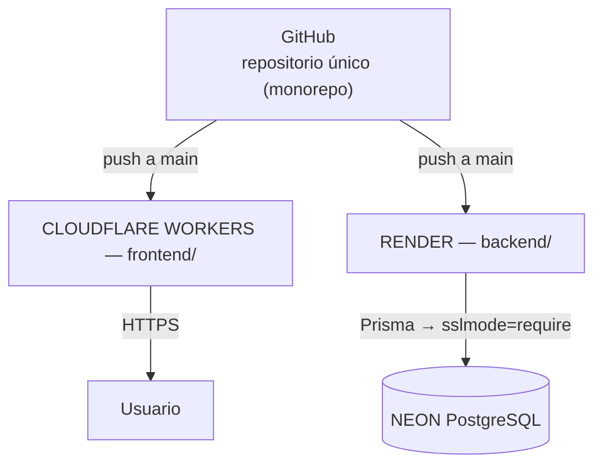

# 10 — Despliegue e Infraestructura

Costo objetivo: **$0/mes** usando planes gratuitos.

---

## 1. Topología de producción

- Render con **root directory** configurado: `backend/`.
- Cloudflare Workers Builds conectado al repo: build desde la raíz del monorepo; config declarativa en `wrangler.jsonc` (raíz).
- Deploy automático en push a `main` (ambos servicios).

## 2. Frontend — Cloudflare Workers

Workers Builds conectado al repositorio: deploy automático en push a `main`.

| Config | Valor |
|--------|-------|
| Proyecto | `kashira-fin` |
| Build command | `cd frontend && npm ci && npm run build` |
| Deploy command | `npx wrangler deploy` |
| Assets (output) | `./frontend/dist/frontend/browser` (declarado en `wrangler.jsonc`) |
| SPA fallback | `not_found_handling: single-page-application` |
| Variable | `environment.ts` producción con URL de la API en Render |

La configuración vive íntegramente en `wrangler.jsonc`, versionado en la raíz del monorepo.

## 3. Backend — Render (Web Service free)

| Config | Valor |
|--------|-------|
| Root directory | `backend` |
| Build command | `npm ci && npx prisma generate && npm run build` |
| Start command | `npx prisma migrate deploy && npm run start:prod` |
| Health check path | `/api/health` |
| Variables | `DATABASE_URL`, `JWT_SECRET`, `JWT_EXPIRES_IN`, `CORS_ORIGIN` |

- `migrate deploy` en el start garantiza esquema actualizado antes de recibir tráfico.
- Render inyecta su propio `PORT`: escuchar sobre él.

## 4. Base de datos — Neon (free tier)

- Cadena de conexión con `?sslmode=require`.
- Usar el **connection pooler** (endpoint `-pooler`) para la app; directo para migraciones.
- Branch de desarrollo opcional (`development`) separado de `production` para pruebas de migraciones.

## 5. Variables de entorno por entorno

| Variable | Desarrollo | Producción |
|----------|-----------|------------|
| `DATABASE_URL` | PostgreSQL 18 local (`kashira_dev`) | Neon (connection pooler, `sslmode=require`) |
| `JWT_SECRET` | local `.env` (cualquier valor fuerte) | secreto fuerte en dashboard Render |
| `CORS_ORIGIN` | `http://localhost:4200` | URL workers.dev del Worker |
| `JWT_EXPIRES_IN` / `PORT` | `7d` / 3000 | `7d` / auto Render |

`.env.example` versionado sin valores reales; secretos reales solo en dashboards (Render/Cloudflare) y archivo local fuera de Git.

## 6. Límites del plan gratuito (documentados, no asumidos ilimitados)

| Servicio | Límite principal | Impacto / mitigación |
|----------|-----------------|----------------------|
| **Render** free | ~750 h/mes; **spin-down tras ~15 min** de inactividad; cold start ~30–60 s en siguiente request | Primera consulta lenta tras pausa; health check periódico opcional como mitigación (respeta fair-use). |
| **Neon** free | ~0.5 GB almacenamiento; compute autosuspende tras inactividad (~5 min); cold query ~+500 ms | Suficiente para MVP personal; cold start aceptado. |
| **Cloudflare Workers** free | ~100k invocaciones/día del Worker; las peticiones a assets estáticos son gratuitas e ilimitadas; sin spin-down | SPA estática servida como assets: holgado. |
| **GitHub** | Repos privados gratis ilimitados | Sin impacto. |

Revisar los valores vigentes en cada dashboard al momento del deploy (los planes cambian).

## 7. Procedimiento de primer despliegue (resumen)

1. Crear repo GitHub y push inicial.
2. Crear proyecto Neon; copiar connection string; crear tablas vía `prisma migrate deploy` local apuntando a prod.
3. Crear Web Service en Render (backend) con variables de entorno.
4. Crear el proyecto en Cloudflare dashboard (Workers Builds) conectado al repo; confirmar build/deploy commands de la sección 2.
5. Actualizar `CORS_ORIGIN` (Render) con la URL workers.dev definitiva; verificar `environment.apiUrl`.
6. Verificar E2E desde celular y computador.

## 8. Backups (estrategia futura)

Pendiente documentado (Fase 8): frecuencia, retención, ubicación externa a Neon, procedimiento de restauración y prueba de recuperación. El MVP confía en snapshots de Neon; no se asume que sustituyan backups independientes.
